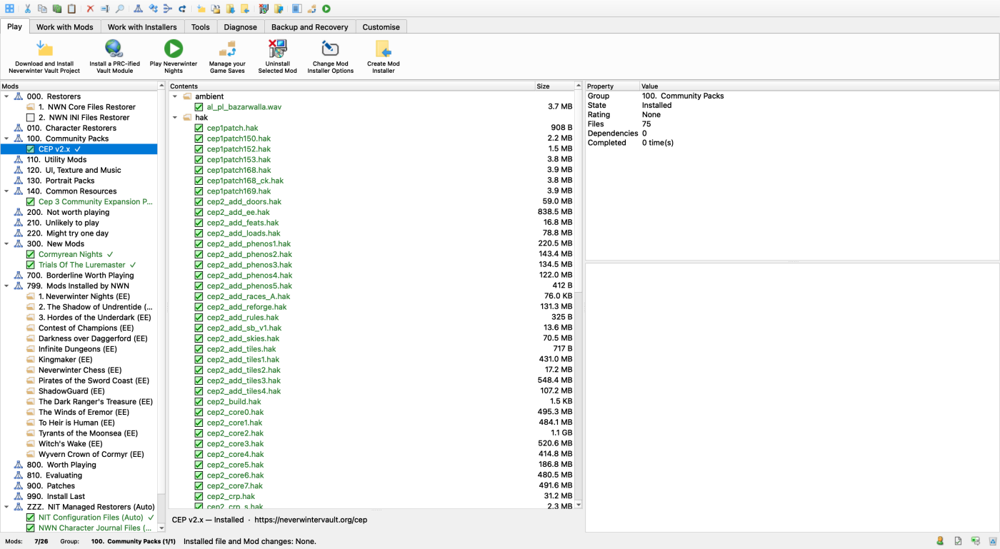
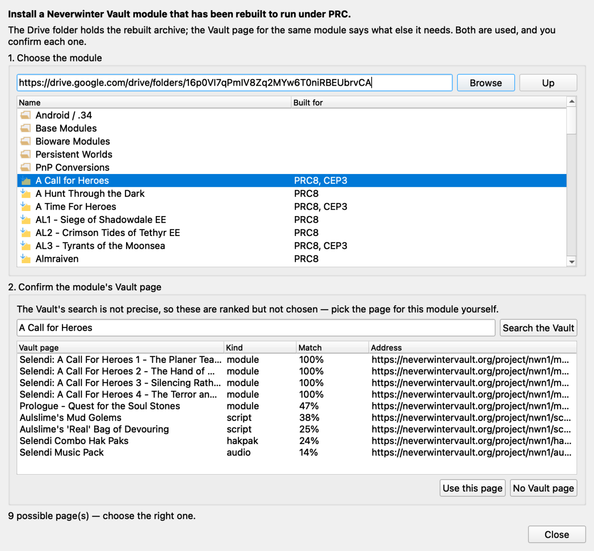

# Vaultkeeper

Install and manage **Neverwinter Nights** mods on **macOS, Windows and Linux** —
including Wine/CrossOver prefixes and network game locations.

A mod is rarely one file. Vaultkeeper keeps a profile of every mod you have, works
out which of its files belong in which game folder, tracks what is installed and
what each file overrides, and can put it all back.



## What it does

- **Mods, grouped.** A profile of your mods and groups, each with its install
  state, showing what is installed, what is overridden by something else, and
  what conflicts.
- **Install and uninstall.** File-level, reversible, and recorded — so removing a
  mod restores whatever it displaced instead of leaving holes.
- **Build installers from downloads.** Point it at the archives a mod ships as; it
  extracts them, maps every file to the folder the game expects, and builds the
  payload.
- **Download from the Vault.** Fetch a project straight from Neverwinter Vault, and
  install modules from the PRC-ified Drive collection with their dependencies
  resolved. Transfers stream to disk and run in the background.

  

- **Play tracking.** Launch the game, and see what you played and for how long.
- **Look inside the game's files.** Characters, items, portraits, haks, ERF/GFF
  contents — the parsers are native, so nothing external is needed to read them.
- **Save game editing** via [nwn-save-editor](https://github.com/yabisiktir/nwn-save-editor),
  which ships inside Vaultkeeper and also runs on its own.

Your game folders are treated as someone else's property: Vaultkeeper keeps its own
store and config, and never silently rewrites `nwn.ini` or `settings.tml`. Changes
to game files are explicit.

## Running it from a checkout

Use a **Python 3.11–3.13** interpreter — PySide6 has no 3.14 wheels yet.

```bash
python3.12 -m venv .venv
source .venv/bin/activate            # Windows: .venv\Scripts\activate

pip install -e ../nwn-save-editor    # the dependency first, see below
pip install -e ".[dev]"

vaultkeeper                          # or: python -m vaultkeeper
```

`python -m vaultkeeper --scan` prints the NWN installs it can find and the store
layout it resolved, without opening a window — handy for checking the path layer on
a new machine.

### The save editor is a separate repository

Vaultkeeper depends on [nwn-save-editor](https://github.com/yabisiktir/nwn-save-editor)
for the NWN file formats (`nwnfile`) and the save editor (`nwnsaveeditor`). It is
not on PyPI, so install it from a checkout **before** installing Vaultkeeper:

```bash
git clone git@github.com:yabisiktir/nwn-save-editor.git ../nwn-save-editor
pip install -e ../nwn-save-editor
```

**Tools → Save Game Editor** opens it in place; it also runs standalone as
`nwn-save-editor`.

## Building an app

```bash
pip install pyinstaller
python scripts/build_app.py --clean
```

Produces a self-contained app — Python, Qt, the UI images, both packages' game
tables and this platform's 7-Zip, all inside it. Roughly 70 MB packaged, 129 MB
installed. The save editor comes along, being a dependency.

| Platform | Artifact |
|---|---|
| macOS | `dist/vaultkeeper-<ver>-macos-<arch>.dmg` |
| Windows | `dist/vaultkeeper-<ver>-windows-x64.zip` |
| Linux | `dist/vaultkeeper-<ver>-linux-<arch>.tar.gz` |

**Each artifact must be built on the OS it targets.** The freeze embeds a Python
interpreter and Qt's native libraries, so there is no cross-building — and that
goes for the CPU too, since PySide6 ships per-architecture wheels and an Apple
Silicon build will not launch on an Intel Mac. That is why the name says which.
Only the current platform's 7-Zip is bundled.

Nothing is signed, so macOS Gatekeeper and Windows SmartScreen will warn on first
run. The hooks for certificates are marked in `packaging/vaultkeeper.spec`.

## Bundled tools

**7-Zip is required, not optional** — mods ship as archives and there is no
pure-Python fallback, so the binary travels with the app instead of being assumed
on your PATH. The builds live under `external/bin/`, committed rather than fetched
at build time, with each platform's `License.txt` beside its binary. See
[`external/tools.toml`](external/tools.toml) for versions and checksums, and
`scripts/fetch_tools.py` to refresh them.

**ffmpeg is deliberately not bundled.** It is only used to convert `.bik` movies to
`.wbm`, the feature degrades gracefully without it, and it is large. If it is on
your PATH it gets used.

ERF/HAK reading is native, so there is no dependency on an external extractor.

## Development

```bash
pytest                 # 1,400+ headless tests; no display needed
ruff check src tests   # lint
mypy                   # type-check
```

Tests run offscreen (`QT_QPA_PLATFORM=offscreen`) and touch neither a real game
install nor the network — the HTTP client and the archive extractor are both
injected seams with fakes. CI runs the suite on three platforms and builds all four
artifacts on every push.

## Layout

```
src/vaultkeeper/
  app_paths.py     # Vaultkeeper's own isolated store/config layout
  config/          # settings
  core/            # the domain: file keys, the mapper, the profile database,
                   # the install engine
  game/            # NWN specifics: install discovery, editions, installers,
                   # play tracking, character and portrait tools
  persistence/     # the native store, and importing a legacy one
  vault/           # Neverwinter Vault + Google Drive download sources
  ui/              # PySide6: main window, ribbon, dialogs
tests/             # headless unit tests
external/          # bundled-binary manifest and binaries
docs/              # notes, guides and the parity ledger
```

## Licence

GPL-3.0-or-later. Design and behaviour follow the *NWN Installer Tool* by Louis
(LazWorks); 7-Zip is bundled under its own licence, reproduced beside each binary.
